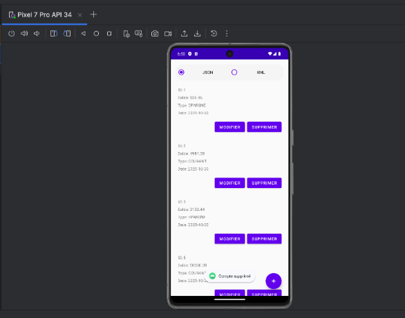
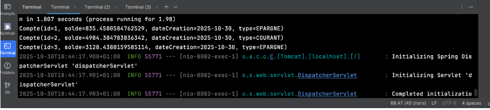
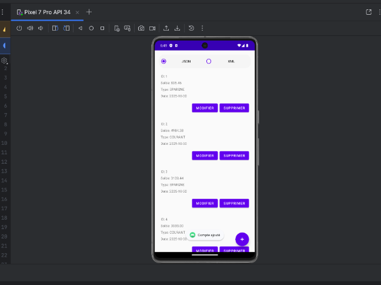
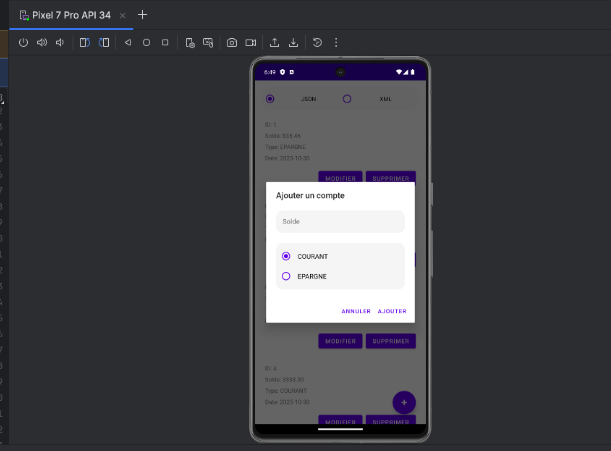

# Bank Account Management - Android REST Client

A modern Android application for managing bank accounts with full CRUD operations, supporting both JSON and XML data formats through a RESTful API integration.

## Table of Contents

- [Overview](#overview)
- [Features](#features)
- [Architecture](#architecture)
- [Screenshots](#screenshots)
- [Technologies](#technologies)
- [Prerequisites](#prerequisites)
- [Installation](#installation)
- [Configuration](#configuration)
- [Usage](#usage)
- [API Documentation](#api-documentation)
- [Project Structure](#project-structure)
- [Contributing](#contributing)
- [License](#license)
- [Author](#author)

## Overview

This Android application demonstrates a complete implementation of the Repository Pattern with Retrofit for consuming RESTful web services. It provides an intuitive interface for managing bank accounts with support for multiple account types (Current/Checking and Savings accounts).

The application showcases modern Android development practices including:
- Clean architecture with separation of concerns
- Asynchronous API calls with Retrofit callbacks
- Material Design UI components
- Dynamic data format switching (JSON/XML)
- Professional error handling and user feedback

## Features

### Core Functionality
- View All Accounts - Display comprehensive list of bank accounts
- Add Account - Create new accounts with balance and type selection
- Update Account - Modify existing account details
- Delete Account - Remove accounts with confirmation dialog
- Format Switching - Toggle between JSON and XML data formats in real-time
- Material Design - Modern, intuitive user interface
- Real-time Updates - Automatic list refresh after operations

### Account Types
- COURANT (Current/Checking Account)
- EPARGNE (Savings Account)

### Data Formats
- JSON - Using Gson converter
- XML - Using SimpleXML converter

## Architecture

## 🏗️ Architecture

The application follows the **Repository Pattern** and **MVC** architecture:

```
┌─────────────────────────────────────────────────────────┐
│                    Presentation Layer                    │
│  ┌──────────────────────────────────────────────────┐   │
│  │          MainActivity (UI Controller)            │   │
│  │  - Handles user interactions                     │   │
│  │  - Updates UI based on data changes              │   │
│  └────────────────┬─────────────────────────────────┘   │
│                   │                                      │
│  ┌────────────────▼─────────────────────────────────┐   │
│  │          CompteAdapter (RecyclerView)            │   │
│  │  - Displays account list                         │   │
│  │  - Handles item click events                     │   │
│  └──────────────────────────────────────────────────┘   │
└─────────────────────────────────────────────────────────┘
                           │
┌──────────────────────────▼──────────────────────────────┐
│                   Business Logic Layer                   │
│  ┌──────────────────────────────────────────────────┐   │
│  │        CompteRepository (Data Abstraction)       │   │
│  │  - Abstracts API calls                           │   │
│  │  - Handles format conversion (JSON/XML)          │   │
│  │  - Implements CRUD operations                    │   │
│  └────────────────┬─────────────────────────────────┘   │
└───────────────────┼─────────────────────────────────────┘
                    │
┌───────────────────▼─────────────────────────────────────┐
│                   Data Access Layer                      │
│  ┌──────────────────────────────────────────────────┐   │
│  │            CompteService (API Interface)         │   │
│  │  - Defines REST endpoints                        │   │
│  │  - GET, POST, PUT, DELETE operations             │   │
│  └────────────────┬─────────────────────────────────┘   │
│                   │                                      │
│  ┌────────────────▼─────────────────────────────────┐   │
│  │         RetrofitClient (HTTP Client)             │   │
│  │  - Configures Retrofit instance                  │   │
│  │  - Manages converters (Gson/SimpleXML)           │   │
│  └────────────────┬─────────────────────────────────┘   │
└───────────────────┼─────────────────────────────────────┘
                    │
            ┌───────▼────────┐
            │   REST API     │
            │  (Backend)     │
            └────────────────┘
```

### Design Patterns Used

1. **Repository Pattern** - `CompteRepository` abstracts data operations
2. **Singleton Pattern** - `RetrofitClient` ensures single HTTP client instance
3. **ViewHolder Pattern** - `CompteAdapter.CompteViewHolder` for efficient RecyclerView
4. **Callback Pattern** - Asynchronous API response handling

## Screenshots

### Backend Spring Boot API

*RESTful API backend showing account management endpoints*

### Add New Account

*Dialog for creating a new bank account with balance and type selection*

### Update Account

*Edit existing account details with pre-populated form*

### Delete Account

*Confirmation dialog before deleting an account*

## Technologies

### Android Framework
- **Platform**: Android 8.0+ (API 26+)
- **Language**: Java
- **UI**: Material Design Components
- **RecyclerView**: Efficient list display

### Libraries & Dependencies

| Library | Version | Purpose |
|---------|---------|---------|
| [Retrofit](https://square.github.io/retrofit/) | 2.9.0 | HTTP client for REST API calls |
| [Gson](https://github.com/google/gson) | 2.10.1 | JSON serialization/deserialization |
| [SimpleXML](http://simple.sourceforge.net/) | 2.7.1 | XML parsing and conversion |
| [Material Components](https://material.io/develop/android) | Latest | Material Design UI components |
| [RecyclerView](https://developer.android.com/reference/androidx/recyclerview/widget/RecyclerView) | Latest | Efficient list display |

### Backend Requirements
- **Spring Boot REST API** (running on `http://10.0.2.2:8082/`)
- Endpoints: `/api/comptes`
- Supports both JSON and XML content negotiation

## Prerequisites

Before running this application, ensure you have:

### Development Environment
- Android Studio Arctic Fox (2020.3.1) or newer
- JDK 11 or higher
- Android SDK API Level 26+
- Gradle 7.0+

### Backend Setup
- Spring Boot Backend running on port 8082
- Backend must be accessible at `http://10.0.2.2:8082/` (Android emulator)
  - For physical devices, update `BASE_URL` in `RetrofitClient.java` to your machine's IP

### Testing Environment
- Android Emulator (API 26+) or
- Physical Android Device with USB debugging enabled

## Installation

## 📥 Installation

### 1. Clone the Repository

```bash
git clone https://github.com/mohamed0009/TP10.git
cd TP10
```

### 2. Open in Android Studio

1. Launch **Android Studio**
2. Select **Open an Existing Project**
3. Navigate to the cloned repository folder
4. Click **OK** and wait for Gradle sync

### 3. Configure Dependencies

The project uses Gradle for dependency management. Dependencies will be automatically downloaded during the first build.

**build.gradle (Module: app)**
```gradle
dependencies {
    // Retrofit for REST API
    implementation 'com.squareup.retrofit2:retrofit:2.9.0'
    implementation 'com.squareup.retrofit2:converter-gson:2.9.0'
    implementation 'com.squareup.retrofit2:converter-simplexml:2.9.0'
    
    // Material Design
    implementation 'com.google.android.material:material:1.9.0'
    
    // RecyclerView
    implementation 'androidx.recyclerview:recyclerview:1.3.0'
}
```

### 4. Build the Project

```bash
./gradlew clean build
```

## Configuration

### Backend URL Configuration

**Location**: `app/src/main/java/ma/projet/restclient/config/RetrofitClient.java`

```java
private static final String BASE_URL = "http://10.0.2.2:8082/";
```

**Configuration Options**:

| Environment | URL | Notes |
|-------------|-----|-------|
| Android Emulator | `http://10.0.2.2:8082/` | Default - maps to localhost |
| Physical Device | `http://YOUR_IP:8082/` | Replace with your machine's IP |
| Production | `https://api.example.com/` | Production server URL |

### Network Security Configuration

**Location**: `app/src/main/res/xml/network_security_config.xml`

Ensure cleartext traffic is allowed for development:
```xml
<?xml version="1.0" encoding="utf-8"?>
<network-security-config>
    <base-config cleartextTrafficPermitted="true" />
</network-security-config>
```

**Warning**: Disable cleartext traffic in production and use HTTPS!

## Usage

### Running the Application

#### Option 1: Android Studio
1. Connect an Android device or start an emulator
2. Click the **Run** button (▶️) or press `Shift + F10`
3. Select target device
4. Wait for installation and launch

#### Option 2: Command Line
```bash
./gradlew installDebug
adb shell am start -n ma.projet.restclient/.MainActivity
```

### Application Workflow

#### 1. **View Accounts**
- Launch the app to see the list of all accounts
- Each item shows: ID, Balance, Type, and Creation Date

#### 2. **Switch Data Format**
- Use the **Radio Buttons** at the top:
  - `JSON` - Fetches data in JSON format
  - `XML` - Fetches data in XML format
- List automatically refreshes when format changes

#### 3. **Add New Account**
- Tap the **Floating Action Button** (+)
- Enter account details:
  - **Balance**: Numeric value (e.g., 1000.00)
  - **Type**: Select COURANT or EPARGNE
- Tap **"Ajouter"** to create
- List refreshes automatically

#### 4. **Update Account**
- Tap the **Edit button** on any account
- Modify balance or type
- Tap **"Modifier"** to save changes

#### 5. **Delete Account**
- Tap the **Delete button** on any account
- Confirm deletion in the dialog
- Account is removed and list refreshes

## API Documentation

### Base URL
```
http://10.0.2.2:8082/api/comptes
```

### Endpoints

#### 1. Get All Accounts (JSON)
```http
GET /api/comptes
Accept: application/json
```

**Response**:
```json
[
  {
    "id": 1,
    "solde": 5000.0,
    "type": "COURANT",
    "dateCreation": "2025-11-09"
  },
  {
    "id": 2,
    "solde": 10000.0,
    "type": "EPARGNE",
    "dateCreation": "2025-11-09"
  }
]
```

#### 2. Get All Accounts (XML)
```http
GET /api/comptes
Accept: application/xml
```

**Response**:
```xml
<List>
  <item>
    <id>1</id>
    <solde>5000.0</solde>
    <type>COURANT</type>
    <dateCreation>2025-11-09</dateCreation>
  </item>
  <item>
    <id>2</id>
    <solde>10000.0</solde>
    <type>EPARGNE</type>
    <dateCreation>2025-11-09</dateCreation>
  </item>
</List>
```

#### 3. Get Account by ID
```http
GET /api/comptes/{id}
```

#### 4. Create Account
```http
POST /api/comptes
Content-Type: application/json

{
  "solde": 7500.0,
  "type": "COURANT",
  "dateCreation": "2025-11-09"
}
```

#### 5. Update Account
```http
PUT /api/comptes/{id}
Content-Type: application/json

{
  "id": 1,
  "solde": 8000.0,
  "type": "EPARGNE",
  "dateCreation": "2025-11-09"
}
```

#### 6. Delete Account
```http
DELETE /api/comptes/{id}
```

## Project Structure

```
app/
├── src/
│   ├── main/
│   │   ├── java/ma/projet/restclient/
│   │   │   ├── MainActivity.java              # Main UI controller
│   │   │   ├── adapter/
│   │   │   │   └── CompteAdapter.java         # RecyclerView adapter
│   │   │   ├── api/
│   │   │   │   └── CompteService.java         # Retrofit API interface
│   │   │   ├── config/
│   │   │   │   └── RetrofitClient.java        # Retrofit configuration
│   │   │   ├── entities/
│   │   │   │   ├── Compte.java                # Account entity model
│   │   │   │   └── CompteList.java            # XML wrapper for account list
│   │   │   └── repository/
│   │   │       └── CompteRepository.java      # Data access layer
│   │   ├── res/
│   │   │   ├── layout/
│   │   │   │   ├── activity_main.xml          # Main screen layout
│   │   │   │   ├── dialog_add_compte.xml      # Add/Edit dialog layout
│   │   │   │   └── item_compte.xml            # RecyclerView item layout
│   │   │   ├── values/
│   │   │   │   ├── colors.xml                 # Color definitions
│   │   │   │   ├── strings.xml                # String resources
│   │   │   │   └── themes.xml                 # App themes
│   │   │   └── xml/
│   │   │       └── network_security_config.xml # Network security settings
│   │   └── AndroidManifest.xml                # App manifest
│   └── test/
│       └── java/ma/projet/restclient/
│           └── ExampleUnitTest.kt             # Unit tests
├── build.gradle                               # Module-level Gradle config
└── proguard-rules.pro                         # ProGuard configuration
```

## Contributing

Contributions are welcome! Please follow these steps:

### 1. Fork the Repository
```bash
git clone https://github.com/mohamed0009/TP10.git
cd TP10
git checkout -b feature/your-feature-name
```

### 2. Make Changes
- Follow Java coding conventions
- Add JavaDoc comments for new methods
- Ensure code is properly formatted

### 3. Test Your Changes
```bash
./gradlew test
./gradlew connectedAndroidTest
```

### 4. Submit Pull Request
- Push your branch to GitHub
- Create a Pull Request with a clear description
- Wait for code review

### Code Style Guidelines
- Use **4 spaces** for indentation
- Follow **JavaDoc** standards for documentation
- Keep methods **focused and small**
- Use **meaningful variable names**
- Add **error handling** for API calls

## License

This project is licensed under the **MIT License**. See the [LICENSE](LICENSE) file for details.

```
MIT License

Copyright (c) 2025 Mohamed

Permission is hereby granted, free of charge, to any person obtaining a copy
of this software and associated documentation files (the "Software"), to deal
in the Software without restriction, including without limitation the rights
to use, copy, modify, merge, publish, distribute, sublicense, and/or sell
copies of the Software...
```

## Author

**Mohamed**  
GitHub: [@mohamed0009](https://github.com/mohamed0009)

## Acknowledgments

- **Retrofit** team for the excellent HTTP client library
- **Google** for Android development tools and Material Design
- **Spring Boot** community for backend framework
- **SimpleXML** for XML parsing capabilities

## Future Enhancements

- [ ] Implement local caching with Room database
- [ ] Add authentication and user management
- [ ] Support for multiple currencies
- [ ] Transaction history tracking
- [ ] Data visualization with charts
- [ ] Offline mode support
- [ ] Push notifications for account updates
- [ ] Dark mode theme
- [ ] Biometric authentication
- [ ] Export data to PDF/CSV

## Changelog

### Version 1.0.0 (2025-11-09)
- Initial release
- CRUD operations for bank accounts
- JSON and XML format support
- Material Design UI
- Repository pattern implementation
- Comprehensive documentation

Made with care by Mohamed
