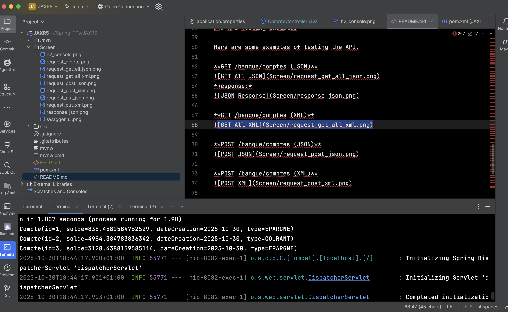
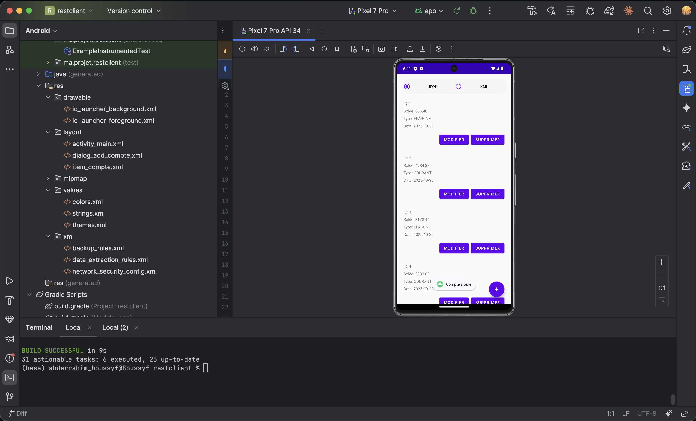
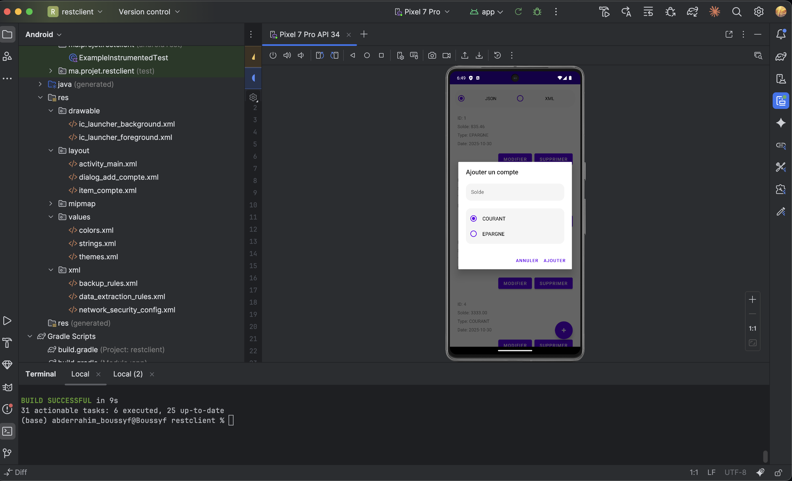

# Gestion de Comptes Bancaires

Créer une application Android permettant de consommer un service REST pour gérer des comptes bancaires avec des fonctionnalités CRUD (Create, Read, Update, Delete). L'application utilisera Retrofit pour les appels API et RecyclerView pour l'affichage des données.

## Captures d'écran

### Backend Spring

### Ajouter Compte

### Modifier Compte

### Supprimer Compte

